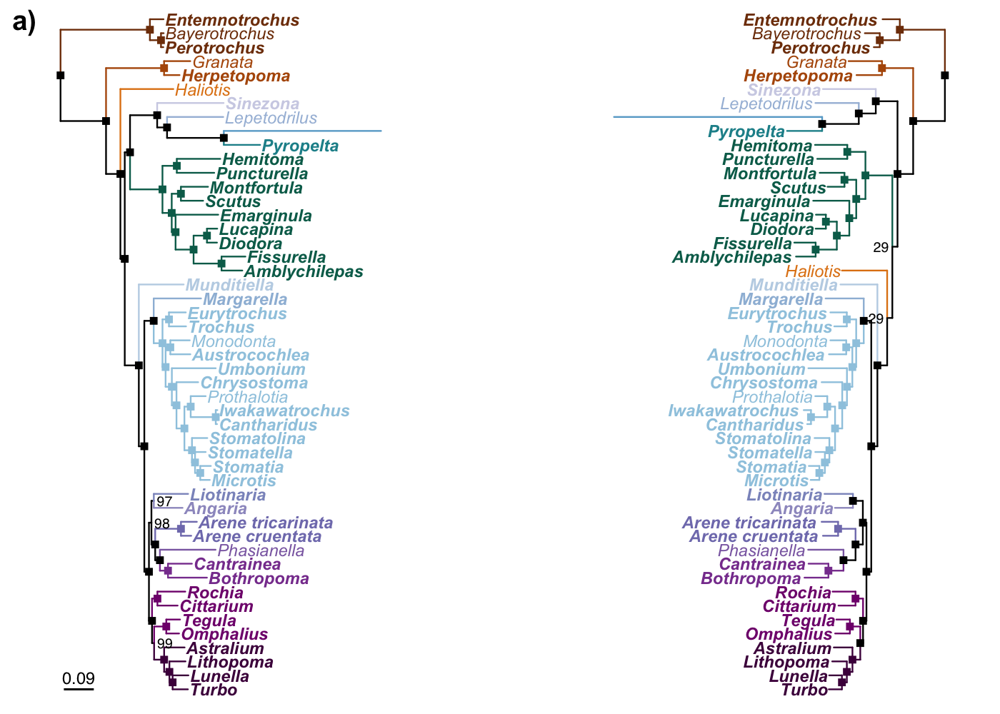
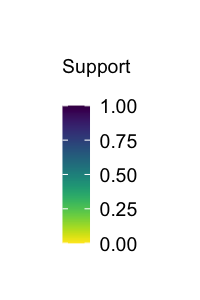
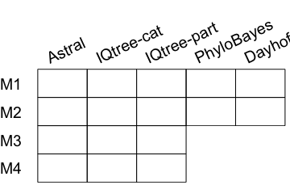
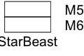
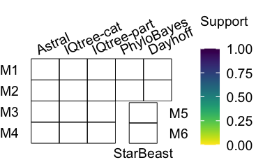
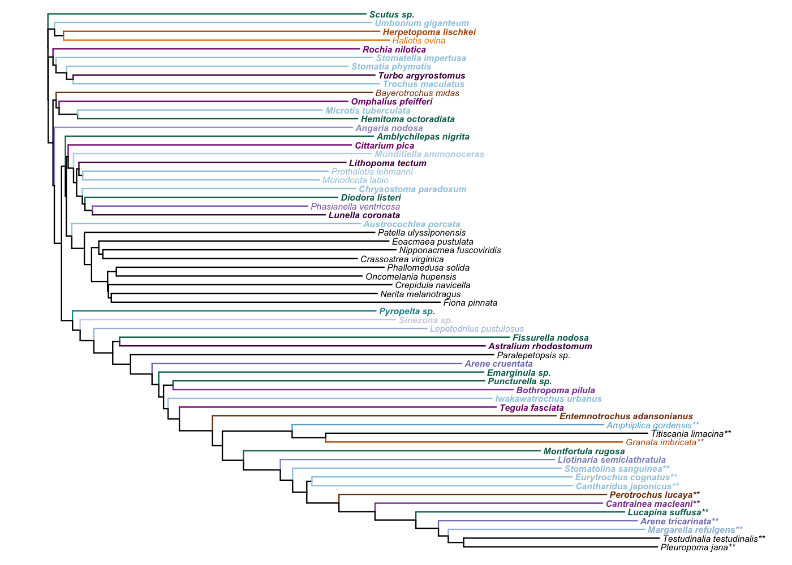

Supplementary Code S1: Trees
================
Tauana Cunha \| <https://tauanacunha.com>
May 2021

<font size="4">Cunha et al. 2021. Investigating Sources of Conflict in
Deep Phylogenomics of Vetigastropod Snails. Systematic Biology.</font>

This document contains the R code to produce the figures of
phylogenetic trees. See the main article for more information.

------------------------------------------------------------------------

# Required libraries

``` r
.libPaths(new = "libR/")
library(tidyverse)
library(treeio)
library(phytools)
library(ggtree)
library(cowplot)
```

# Transcriptomes metadata

This is Supplementary Table S1 in Dryad:

``` r
data_spp = read_csv("../data/Gastropoda Transcriptomes - Data.csv")
data_spp
```

    ## # A tibble: 62 x 23
    ##    `Terminal Name … Species Clade Family Genus SRA   Voucher `Illumina Index`
    ##    <chr>            <chr>   <chr> <chr>  <chr> <chr> <chr>   <chr>           
    ##  1 Amblychilepas_n… Amblyc… Veti… Fissu… Ambl… <NA>  MCZ 37… 4               
    ##  2 Diodora_listeri… Diodor… Veti… Fissu… Diod… <NA>  MCZ 38… 4               
    ##  3 Emarginula_3862… Emargi… Veti… Fissu… Emar… <NA>  MCZ 38… 6               
    ##  4 Fissurella_nodo… Fissur… Veti… Fissu… Fiss… <NA>  MCZ 38… 12              
    ##  5 Hemitoma_octora… Hemito… Veti… Fissu… Hemi… <NA>  MCZ 38… 6               
    ##  6 Lucapina_suffus… Lucapi… Veti… Fissu… Luca… <NA>  MCZ 37… 1               
    ##  7 Montfortula_rug… Montfo… Veti… Fissu… Mont… <NA>  MCZ 37… 2               
    ##  8 Puncturella_378… Punctu… Veti… Fissu… Punc… <NA>  MCZ 37… 11              
    ##  9 Scutus_386180    Scutus… Veti… Fissu… Scut… <NA>  MCZ 38… 7               
    ## 10 Haliotis_ovina_… Haliot… Veti… Halio… Hali… SRR8… MCZ 38… 5               
    ## # … with 52 more rows, and 15 more variables: `Number of Read Pairs` <dbl>,
    ## #   `Number of Read Pairs After Filtering` <dbl>, N50 <dbl>, `Final Number of
    ## #   Peptides` <dbl>, BUSCO <chr>, Source <chr>, DOI <chr>, Sequencing <chr>,
    ## #   `Voucher Link` <chr>, `% Genes in Matrix 1` <dbl>, `% Genes in Matrix
    ## #   2` <dbl>, `% Genes in Matrix 3` <dbl>, `% Genes in Matrix 4` <dbl>, `%
    ## #   Genes in Matrix 5` <dbl>, `% Genes in Matrix 6` <dbl>

# Tree files

Organize analyses, matrices and tree file names:

``` r
data_trees = read.csv("../data/data_trees.txt") # Simple table with names of analyses and matrices

data_trees = data_trees %>%
  mutate(treename = paste(method, matrix, sep = "_"), # Column for tree names for later
         filename = NA)

for(i in 1:dim(data_trees)[1]){ # Get tree file name for each combination
  data_trees[i,5] = grep(data_trees[i,1], dir("../data/trees/"),
                         ignore.case = T, value = T) %>%
    grep(data_trees[i,3], ., ignore.case = T, value = T)}
```

``` r
data_trees
```

    ##        method         matrix          analysis                 treename
    ## 1      Astral             M1            31taxa                Astral_M1
    ## 2      Astral             M2            44taxa                Astral_M2
    ## 3      Astral             M3          evorates                Astral_M3
    ## 4      Astral             M4       homogeneous                Astral_M4
    ## 5   IQTREEcat             M1            31taxa             IQTREEcat_M1
    ## 6   IQTREEcat             M2            44taxa             IQTREEcat_M2
    ## 7   IQTREEcat             M3          evorates             IQTREEcat_M3
    ## 8   IQTREEcat             M4       homogeneous             IQTREEcat_M4
    ## 9  IQTREEpart             M1            31taxa            IQTREEpart_M1
    ## 10 IQTREEpart             M2            44taxa            IQTREEpart_M2
    ## 11 IQTREEpart             M3          evorates            IQTREEpart_M3
    ## 12 IQTREEpart             M4       homogeneous            IQTREEpart_M4
    ## 13 PhyloBayes             M1            31taxa            PhyloBayes_M1
    ## 14 PhyloBayes             M2            44taxa            PhyloBayes_M2
    ## 15 Dayhoff-PB             M1            31taxa            Dayhoff-PB_M1
    ## 16 Dayhoff-PB             M2            44taxa            Dayhoff-PB_M2
    ## 17  StarBeast             M5 70resolved_Pleuro             StarBeast_M5
    ## 18  StarBeast             M6 75resolved_Pleuro             StarBeast_M6
    ## 19  IQTREEcat M1-MissingData       missingdata IQTREEcat_M1-MissingData
    ## 20     Astral         M1-PCS               PCS            Astral_M1-PCS
    ##                                      filename
    ## 1                     Rooted_astral31taxa.tre
    ## 2                     Rooted_astral44taxa.tre
    ## 3                   Rooted_astralEvorates.tre
    ## 4                Rooted_astralHomogeneous.tre
    ## 5                  Rooted_iqtreecat31taxa.tre
    ## 6                  Rooted_iqtreecat44taxa.tre
    ## 7                Rooted_iqtreecatEvorates.tre
    ## 8             Rooted_iqtreecatHomogeneous.tre
    ## 9                 Rooted_iqtreepart31taxa.tre
    ## 10                Rooted_iqtreepart44taxa.tre
    ## 11              Rooted_iqtreepartEvorates.tre
    ## 12           Rooted_iqtreepartHomogeneous.tre
    ## 13                Rooted_phylobayes31taxa.tre
    ## 14                Rooted_phylobayes44taxa.tre
    ## 15                Rooted_dayhoff-pb31taxa.tre
    ## 16                Rooted_dayhoff-pb44taxa.tre
    ## 17 starbeast70resolved_PleuroOut_species.tree
    ## 18 starbeast75resolved_PleuroOut_species.tree
    ## 19            Rooted_iqtreecatMissingData.tre
    ## 20                       Rooted_astralPCS.tre

Import all tree files:

``` r
trees = purrr::map(.x = paste("../data/trees/", data_trees$filename, sep = ""),
                   .f = read.beast)

names(trees) = data_trees$treename
```

Change support column name of Beast to match that of other trees:

``` r
for(i in 1:length(trees)){
  if(grepl('Beast', names(trees[i]))){
    colnames(trees[[i]]@data)[colnames(trees[[i]]@data) == "posterior"] <- "support"}}
```

StarBeast tip names are just genera; match with others so they are all
the same:

``` r
pattern_to_find = paste0(trees$StarBeast_M5@phylo$tip.label, collapse = "|")

trees$StarBeast_M5@phylo$tip.label <- data_spp %>%
  arrange(`Terminal Name in Files`) %>%
  filter(grepl(pattern_to_find, `Terminal Name in Files`)) %>%
  pull(`Terminal Name in Files`)

trees$StarBeast_M6@phylo$tip.label <- data_spp %>%
  arrange(`Terminal Name in Files`) %>%
  filter(grepl(pattern_to_find, `Terminal Name in Files`)) %>%
  pull(`Terminal Name in Files`)
```

Extract clade of vetigastropods, removing outgroups to fit ingroup
better in figures:

``` r
ingroup_bounds = c("Bayerotrochus_midas", "Tectus_niloticus_386138")

ingroup_node = purrr::map_dfr(.x = trees,
                              .f = ~MRCA(.x, ingroup_bounds[1], ingroup_bounds[2]))

trees = purrr::map2(.x = trees,
                    .y = ingroup_node,
                    .f = ~tree_subset(.x, .y, levels_back = 0))
```

# Family nodes and offspring taxa

List of families to guide color code in figures later:

``` r
fam_clades = list(Pleurotomariidae = c("Entemnotrochus_adansonianus_383057", "Bayerotrochus_midas"),
                 Chilodontaidae = c("Herpetopoma_lischkei_386199", "Granata_imbricata"),
                 Haliotidae = c("Haliotis_ovina_386141"),
                 Scissurellidae = c("Sinezona_386201"),
                 Lepetodrilidae = c("Lepetodrilus_pustulosus"),
                 Pyropeltidae = c("Pyropelta_378705"),
                 Pseudococculinidae = c("Amphiplica_gordensis"),
                 Fissurellidae = c("Puncturella_378697", "Diodora_listeri_383694"),
                 Skeneidae = c("Munditiella_ammonoceras_386250"),
                 Calliostomatidae = c("Margarella_refulgens_386946"),
                 Trochidae = c("Trochus_maculatus_386111", "Stomatia_phymotis_386190"),
                 Angariidae = c("Angaria_nodosa_386154"),
                 Liotiidae = c("Liotina_semiclathratula_386208"),
                 Areneidae = c("Arene_cruentata_384363", "Marevalvata_tricarinata_378576"),
                 Phasianellidae = c("Phasianella_ventricosa"),
                 Colloniidae = c("Bothropoma_pilula_386247", "Cantrainea_macleani_378278"),
                 Tegulidae1 = c("Omphalius_pfeifferi_386110", "Tegula_fasciata_384351"),
                 Tegulidae2 = c("Cittarium_pica_384348", "Tectus_niloticus_386138"),
                 Turbinidae = c("Astralium_386156", "Lunella_coronata_386133"))
```

Wrap function for MRCA based on specified tree and tip names:

``` r
tr_mrca = function(tr, tp1, tp2){ # trees list is hard-coded inside
  if(! tp1 %in% trees[[tr]]@phylo$tip.label){ # For clades missing in a given tree
    return(NA)} # Do nothing
  else if(is.na(tp2) | ! tp2 %in% trees[[tr]]@phylo$tip.label){ # For clades with only 1 terminal
    MRCA(trees[[tr]], tp1) %>% as.character()} # MRCA of only one terminal
  else{
    MRCA(trees[[tr]], tp1, tp2) %>% as.character()}} # MRCA of two terminals
#tr_mrca("IQTREEcat_M1-MissingData", "Amphiplica_gordensis", NA)
```

For each tree file, get MRCA for each node of interest and then all of
its descendants:

``` r
fam_nodes = expand_grid(clade = names(fam_clades), tree = names(trees)) %>%
  rowwise() %>% # New df with all combinations of trees and clades
  mutate(tip1 = fam_clades[[clade]][1],
         tip2 = fam_clades[[clade]][2])

clade_nodes = fam_nodes

clade_nodes = clade_nodes %>%
  rowwise() %>%
  mutate(node = as.numeric(tr_mrca(tree, tip1, tip2))) %>% # Apply MRCA func in each line
  group_by(tree) %>% # For each tree/analysis
  rowwise %>% # Take MRCA info line by line
  mutate(offspring = ifelse(is.na(node), NA,
    list(c(node, offspring(.data = trees[[tree]], .node = node))))) %>% # Descendants
  ungroup %>%
  select(tree, clade, node, offspring)
```

``` r
clade_nodes
```

    ## # A tibble: 380 x 4
    ##    tree          clade             node offspring
    ##    <chr>         <chr>            <dbl> <list>   
    ##  1 Astral_M1     Pleurotomariidae    51 <dbl [5]>
    ##  2 Astral_M2     Pleurotomariidae    51 <dbl [5]>
    ##  3 Astral_M3     Pleurotomariidae    51 <dbl [5]>
    ##  4 Astral_M4     Pleurotomariidae    51 <dbl [5]>
    ##  5 IQTREEcat_M1  Pleurotomariidae    51 <dbl [5]>
    ##  6 IQTREEcat_M2  Pleurotomariidae    51 <dbl [5]>
    ##  7 IQTREEcat_M3  Pleurotomariidae    51 <dbl [5]>
    ##  8 IQTREEcat_M4  Pleurotomariidae    51 <dbl [5]>
    ##  9 IQTREEpart_M1 Pleurotomariidae    51 <dbl [5]>
    ## 10 IQTREEpart_M2 Pleurotomariidae    51 <dbl [5]>
    ## # … with 370 more rows

# Supplementary Figures: trees

## Tree skeleton

Plot simple tree skeleton and merge transcriptome data to ggtree
objects:

``` r
ggtrs = purrr::map(.x = trees, # size 0.4 equals 0.85pt in AI
                   .f = ~ggtree(tr = .x, right = TRUE, size=0.4)) # linetype=1

for(i in 1:length(ggtrs)){
  ggtrs[[i]] = ggtrs[[i]] %<+% data_spp}
```

## Preparation: functions and colors

Choose color scheme:

``` r
fam_colors = list("NA" = "black",
                  Pleurotomariidae = "#7f3b08",
                  Chilodontaidae = "#b35806",
                  Haliotidae = "#e08214",
                  Scissurellidae = "#d0d1e6",
                  Lepetodrilidae = "#a6bddb",
                  Pyropeltidae = "#1c9099",
                  Pseudococculinidae = "#67a9cf",
                  Fissurellidae = "#016c59",
                  Skeneidae = "#bfd3e6",
                  Calliostomatidae = "#9ebcda",
                  Trochidae = "#9ecae1", # one hue
                  Angariidae = "#9e9ac8", # one hue
                  Liotiidae = "#8c96c6",
                  Areneidae = "#807dba",
                  Phasianellidae = "#8c6bb1",
                  Colloniidae = "#88419d",
                  Tegulidae = "#810f7c",
                  Turbinidae = "#4d004b")
```

To color tree by family, need to create a grouping by family. Already
have that for the tips from the transcriptome data, but also want to
assign the internal nodes of each family to the corresponding group so
that the internal branches are also colored accordingly.  
Start with a function that takes a node number and finds its parent
family:

``` r
# clade_nodes needs to be filtered to one tree only before given to function as df_clade_nodes
find_family_of_internal_node = function(node_i, df_clade_nodes){
  tmp = df_clade_nodes %>%
    purrr::map(.x = .$offspring,
               .f = ~node_i %in% .x) %>% unlist # Find node_i in offspring column of clade_nodes
  
  fam = df_clade_nodes %>%
    filter(tmp) %>% # Takes TRUE from above to select line of family where node belongs
    pull(clade) # Pull name of family
  
  if(length(fam) == 0){ # If internal node does not belong to any family (basal node)
    return(NA)} # Maintains NA so that ggtree plots black
  else{return(fam)}} # If family assigned, return family name
#find_family_of_internal_node(22, clade_nodes %>% filter(tree == names(ggtrs[5])))
```

Use created function to fill ggtree$data with family names for the
internal nodes:

``` r
# Tegulidae not monophyletic but I will use the same color,
# so I create a temporary version of clade_nodes without distinction of two subgroups
tmp_clade_nodes = clade_nodes %>%
  mutate(clade = ifelse(clade == "Tegulidae1" | clade == "Tegulidae2", "Tegulidae", clade)) %>%
  rowwise() %>%
  mutate(color = unlist(fam_colors[as.character(clade)])) %>%
  ungroup

# Actual filling of info for internal nodes:
for(i in 1:length(ggtrs)){
  ggtrs[[i]]$data = ggtrs[[i]]$data %>%
    rowwise %>% # Row by row, to take one node number at a time
    mutate(Family = ifelse(is.na(Family),
                           find_family_of_internal_node(node_i = node,
                                                        df_clade_nodes = tmp_clade_nodes %>%
                                                          filter(tree == names(ggtrs[i]))),
                           Family))}
```

Function to plot support as filled squares for fully supported nodes,
and actual value for other nodes:

``` r
plot_support_symbol = function(ggtr, nodes=NULL, fontsize=2){
  if (is.null(nodes)){ggtr$data$include_node = !ggtr$data$isTip} # No subset of nodes
  else {ggtr$data$include_node = ggtr$data$node %in% nodes} # Subset of nodes in argument
  
  if (100 %in% ggtr$data$support){ # For bootstrap
    output <- ggtr +
      geom_point2(aes(subset=include_node & support==100, color=Family),
                  shape=15) + # Squares
      geom_text2(aes(subset=include_node & support<100, color=Family, label=support),
                 hjust=-0.2, size = fontsize)} # Text
  
  else { # For Bayesian pp or other support values between 0 and 1
    ggtr$data$support <- round(as.numeric(ggtr$data$support), 2)
    output <- ggtr +
      geom_point2(aes(subset=include_node & support==1.00, color=Family),
                  shape=15) +
      geom_text2(aes(subset=include_node & support<1.00, color=Family,
                     label=support),
                     #label=signif(as.numeric(support), 3)),
                 hjust=-0.2, size = fontsize)}
  return(output)}
```

Function to plot terminal names with specific font: italics for all,
bold for new transcriptomes:

``` r
plot_tips = function(ggtr, fontsize=2){
  output <- ggtr + #, offset = 0.02
    geom_tiplab(aes(subset = Source!="This study" | is.na(Source), label = Species), #new add:|is.na(Source)
                fontface = 'italic', size = fontsize) + # size 2 = 6pt in AI, 2.5 = 7pt
    geom_tiplab(aes(subset = Source=="This study", label = Species),
                fontface = 'bold.italic', size = fontsize)
  return(output)}
```

## Customize trees

Add colors, tip labels, scale and support:

``` r
ggtrs_plus = list()
for(i in 1:length(ggtrs)){
  ggtrs_plus[[i]] <- ggtrs[[i]] +
    geom_treescale(x=.01, y=1, fontsize=2) +
    aes(color = Family) +
    scale_color_manual(values = fam_colors, na.value = "black") +
    theme(legend.position = "none")}

names(ggtrs_plus) = names(ggtrs)

ggtrs_plus = purrr::map(.x = ggtrs_plus, .f = plot_tips) %>%
  purrr::map(.f = plot_support_symbol)
```

Each method/analysis has a slightly different total branch length,
especially for the long branch of Amphiplica, so let’s adjust xlim for
each tree individually so they do not cut the tip label:

``` r
xlim_trs = data.frame(tree = names(ggtrs_plus), xlim = c(12, 10, 12, 11.5,
                                                         1.4, 1.4, 1.5, 1.4,
                                                         1.4, 1.1, 1.4, 1.45,
                                                         3.6, 3.8, 2.7, 3.1,
                                                         0.67, 0.85, 1.4, 11.5))

for(i in 1:length(ggtrs_plus)){
  ggtrs_plus[[i]] = ggtrs_plus[[i]] + xlim(0, xlim_trs[i,2])}
```

## Panel of multiple trees

Strings to be used for file names:

``` r
filenames = data_trees %>%
  select(method) %>%
  unique %>% filter(method != "Dayhoff-PB")
```

For supplementary material, plot 4 trees in one page by method: (astral,
iqtreecat, iqtreepart, phylobayes, starbeast)

``` r
supp_trees = list()
for(i in 1:4){
  pr = 4*i - 3
  se = 4*i
  supp_trees[[i]] = plot_grid(plotlist = ggtrs_plus[pr:se],
                              ncol=2, scale = 0.97, labels = c("a)", "b)", "c)", "d)"))}
# StarBeast has different number of plots and labels:
supp_trees[[5]] = plot_grid(plotlist = ggtrs_plus[17:18],
                            ncol=2, scale = 0.97,
                            labels = c("a)", "b)"))

names(supp_trees) = filenames[[1]]
#supp_trees
```

## Save supplementary files

``` r
paths <- stringr::str_c("../figures/trees/Supp_", names(supp_trees), ".pdf")

pwalk(.l = list(paths, supp_trees),
      .f = ~ggsave(filename = .x, plot = .y,
                   width=6.75, height=9.25, units="in", useDingbats=F))

# Only 2 instead of 4 plots for StarBeast, therefore different file size:
ggsave(file = "../figures/trees/Supp_StarBeast.pdf", plot = supp_trees[[5]],
       width=6.75, height=4.63, units="in", useDingbats=F)
```

# Main tree: Figure 3a

Main figure with two topologies as a cophyloplot, facing each other.
Choosing IQTREE cat and part from the largest matrix M1. (Custom
functions, color scheme and skeleton tree used here were created above
in the section on supplementary trees)

``` r
d1 <- ggtrs[["IQTREEcat_M1"]]$data
d2 <- ggtrs[["IQTREEpart_M1"]]$data

## reverse x-axis and 
## set offset to make the tree in the right hand side of the first tree
d2$x <- max(d2$x) - d2$x + max(d1$x) + 0.7

cophylo <- ggtrs[[5]] +
  geom_tree(data = d2, size = 0.4) +
  geom_tiplab(aes(subset = Source!="This study" & Genus != "Amphiplica", label = Genus),
              fontface = 'italic', size = 3) + #Amphiplica to be added in Illustrator
  geom_tiplab(aes(subset = Source=="This study" & Genus != "Arene", label = Genus),
              fontface = 'bold.italic', size = 3) +
  geom_tiplab(aes(subset = Source=="This study" & Genus == "Arene", label = Species),
              fontface = 'bold.italic', size = 3) +
  geom_tiplab(data = d2, aes(subset = Source!="This study" & Genus != "Amphiplica",
                             label = Genus),
              fontface = 'italic', size = 3, hjust=1.05) + #Amphiplica to be added in Illustrator
  geom_tiplab(data = d2, aes(subset = Source=="This study" & Genus != "Arene", label = Genus),
              fontface = 'bold.italic', size = 3, hjust=1.05) +
  geom_tiplab(data = d2, aes(subset = Source=="This study" & Genus == "Arene",
                             label = Species),
              fontface = 'bold.italic', size = 3, hjust=1.05) +
  geom_treescale(x=.01, y=1, fontsize=3) +
  aes(color = Family) +
  scale_color_manual(values = fam_colors, na.value = "black") +
  theme(legend.position = "none",
        panel.background = element_rect(fill = "transparent", color = NA),
        plot.background = element_rect(fill = "transparent", color = NA))

cophylo = plot_support_symbol(cophylo, fontsize=2.5) +
      geom_point2(data = d2, shape=15,
                  aes(subset = support==100, color = Family)) +
      geom_text2(data = d2, hjust=1.2, size = 2.5,
                 aes(subset = support<100, color = Family, label = support))
```

Plot grid to add a) label and scale down if needed:

``` r
cophylo_grid = plot_grid(cophylo, ncol=1, scale=1, labels = "a)")
```

``` r
cophylo_grid
```

<!-- -->

Save the main figure (this inputs straight to a linked file in
Illustrator):

``` r
ggsave(file = "../figures/trees/cophylo.pdf", plot = cophylo_grid,
       width=6.75, height=6.75, units="in", useDingbats=F)
```

# Support plots: Figure 3b

I will use a grid of all the analyses and matrices to show the support
across analyses with a continuous color scale (I first created this
strategy in [Cunha & Giribet 2019 Proceedings
B](https://doi.org/10.1098/rspb.2018.2776)).  
First, I need to get the support across analyses for all the equivalent
nodes. Then, plot the grid for each node and save the insets as images
in the computer. Then pull them back to their specific node on a chosen
tree. Because trees have different topologies, I am using both trees
from the cophyloplot as references from which to identify nodes of
interest.

## Compile support from all analyses

Create shortcut variables:

``` r
# d1 and d2 (ggtree data objects) were already created above
t1 = ggtrs[["IQTREEcat_M1"]]
t2 = ggtrs[["IQTREEpart_M1"]]
```

Function to get names of tip descendants from specific nodes of
interest:

``` r
get_offspring = function(ggtr, nodes_i=NULL){ # ggtree object, vector with node numbers
  if(is.null(nodes_i)){
    nodes_i = 1:max(ggtr$data$node)}
  
  ggtr$data %>%
    filter(node %in% nodes_i) %>% # Just lines with nodes of interest
    rowwise() %>%
    mutate(descend_id = getDescendants(as.phylo(ggtr), node) %>%
             list) %>% # Get all descendants of node
    mutate(descend_id = descend_id[descend_id <= sum(ggtr$data$isTip)] %>%
             list) %>% # Filter to keep only tip descendants
    mutate(descend_names = filter(ggtr$data, node %in% descend_id) %>%
             pull(label) %>% # Pull tip names
             list) %>%
    ungroup()} # Output: selected lines of ggtree data frame with added column for descendants names
```

Check on the trees which nodes will have a grid of support values:

``` r
#t1 + geom_text(label=t1$data$node)
#t2 + geom_text(label=t2$data$node)
```

Use function to get identity of tip descendants from these nodes:

``` r
o1 = get_offspring(t1, c(56,57)) %>% select(node, descend_names) %>% rowwise()
o2 = get_offspring(t2, c(59,68)) %>% select(node, descend_names) %>% rowwise()
```

Function to get the support for the equivalent node in other
analyses/trees:

``` r
get_support = function(tip_names, ggtr){ # tip_names from reference tree, ggtree from other analysis
  get_offspring(ggtr) %>%
    rowwise() %>%
    filter(setequal(tip_names, descend_names)) %>% # Match tip_names from reference tree with lists of descendants from other analysis
    pull(support) %>% # Get support
    ifelse(length(.) == 0, NA, .)} # If no support because clade doesn't exist, put NA
#get_support(o1$descend_names[[2]],ggtrs[[17]])
```

Use function to get support for the nodes of interest from all trees.
Inputs are list of trees and result of get\_offspring, which only has
the nodes of interest. Output is a data frame with the tree/analysis
name, the node number in the reference tree, and the support value in
the other trees.

``` r
# Actually making the table with ldply - transforms list of imgdata into table with each analysis and support for each node
t1_supp = purrr::map_dfr(.x = ggtrs, .y = o1, .id = "treename",
                         .f = function(.x, .y){
                           .y %>%
                             mutate(supp = get_support(descend_names, .x)) %>%
                             #select(-descend_names) %>% # Exclude column of tip names
                             ungroup()})

t2_supp = purrr::map_dfr(.x = ggtrs, .y = o2, .id = "treename",
                         .f = function(.x, .y){
                           .y %>%
                             mutate(supp = get_support(descend_names, .x)) %>%
                             #select(-descend_names) %>% # Exclude column of tip names
                             ungroup()})
```

``` r
#t1_supp
#t2_supp
```

Function to manipulate dataframe: convert support to decimal, split
treename column into matrix and method columns:

``` r
split_treename = function(t_supp){
  t_supp %>%
  mutate(supp2 = ifelse(grepl("IQTREE", treename), supp/100, round(supp, 2))) %>% # Support to decimal
  select(-supp) %>% rename(supp = supp2) %>% # Keeps only new support column
  rowwise() %>% # Making new columns for ggplot later
  mutate(method=replace(treename, values=str_split(treename, "_")[[1]][1]),
         matrix=replace(treename, values=str_split(treename, "_")[[1]][2])) %>%
  mutate(matrix=factor(matrix, levels=c("M1-PCS","M1-MissingData",
                                        "M6","M5","M4","M3","M2","M1")),
         method=factor(method, levels=c("Astral","IQTREEcat","IQTREEpart",
                                        "PhyloBayes","Dayhoff-PB", "StarBeast"))) %>%
  ungroup() %>% as.data.frame(.)}
```

Use function to adjust data frames for support grids:

``` r
t1_supp = split_treename(t1_supp)
t2_supp = split_treename(t2_supp)
```


## Plot grid legend

Scale for support values:

``` r
grid_leg = ggpubr::as_ggplot(get_legend(ggplot(t1_supp, aes(method, matrix)) +
                                          labs(fill="Support\n") +
                                          theme(legend.key.size = unit(3.5, "mm"),
                                                legend.text=element_text(size=7),
                                                legend.title=element_text(size=7),
                                                legend.background = element_blank(),
                                                plot.margin=unit(c(0, 0, 0, 0), "cm")) +
                                          geom_tile(aes(fill = supp), colour = "white") +
                                          viridis::scale_fill_viridis(limits=c(0,1), direction=-1)))
```

``` r
grid_leg
```

<!-- -->

Empty grids with labels for methods and matrices:

``` r
grid1 = t1_supp %>%
  filter(!(matrix %in% c("M5","M6","M1-MissingData","M1-PCS"))) %>%
  ggplot(aes(method, matrix)) +
  geom_tile(fill = "transparent", colour = "black") +
  scale_x_discrete(position="top", labels = c("Astral","IQtree-cat","IQtree-part",
                                              "PhyloBayes","Dayhoff")) +
  theme(axis.title = element_blank(),
        axis.ticks = element_blank(),
        legend.position="none",
        panel.background = element_rect(fill = "transparent", color = NA),
        plot.background = element_rect(fill = "transparent", color = NA),
        panel.grid = element_blank(),
        axis.text.x = element_text(colour="transparent", size = 7, angle = 25, hjust = 0),
        axis.text.y = element_text(colour="black", size=7),
        plot.margin = unit(c(0, 0, 0, 0), "cm")) +
  coord_cartesian(clip = 'off') +
  annotate(geom = "text", x = seq(0.7,4.7,1), y = 4.88,
           size=2.5, angle=25, hjust=0,
           label = c("Astral","IQtree-cat","IQtree-part","PhyloBayes","Dayhoff"))

grid2 = t1_supp %>%
  filter(method == "StarBeast") %>%
  ggplot(aes(method, matrix)) +
  geom_tile(fill = "transparent", colour = "black") +
  scale_x_discrete(position="bottom", labels = "StarBeast") +
  scale_y_discrete(position = "right") +
  theme(axis.title = element_blank(),
        axis.ticks = element_blank(),
        legend.position="none",
        panel.background = element_rect(fill = "transparent", color = NA),
        plot.background = element_rect(fill = "transparent", color = NA),
        panel.grid = element_blank(),
        axis.text.x = element_text(colour="black", size=7, hjust=0.50, vjust=3.5),
        axis.text.y = element_text(colour="black", size=7),
        plot.margin = unit(c(0, 0, 0, 0), "cm"))
```

``` r
grid1
```

<!-- -->

``` r
grid2
```

<!-- -->

Combine grids to use the empty space:

``` r
grid = ggdraw(ylim = c(-0.1,1)) +
  draw_plot(grid1) +
  draw_plot(grid2, x = 0.725, y = -0.1525, width = .355, height = .4595)
```

Combine grid and color scale in one plot:

``` r
legend = plot_grid(grid, grid_leg, align='v',
                   rel_widths = c(1, 0.6))
```

``` r
legend
```

<!-- -->

Save support legend:

``` r
ggsave(file = "../figures/insets/legend.pdf", plot = legend, bg = "transparent",
       width=2, height=1.15, units="in", useDingbats=F)
```

## Make support plots

Function to plot inset grid of support values and save it to a pdf file:

``` r
make_inset = function(node_i, df){
  df = df %>% filter(node == node_i)
  is_all_supported = all(!is.na(df$supp) & df$supp == 1) # Node where there is variation in support
  
  # Separate to plot one over the other
  g1 = df %>% filter(!(matrix %in% c("M5","M6","M1-MissingData","M1-PCS")))
  g2 = df %>% filter(method == "StarBeast")
  
  if (!is_all_supported){ # If there is variation in support values across analyses
    p1 = g1 %>% # All but StarBeast
      ggplot(aes(method, matrix)) +
      geom_tile(aes(fill = supp), colour = "white") + # White border to squares
      viridis::scale_fill_viridis(limits=c(0,1), direction=-1) + # Continuous color scale
      theme_inset() +
      theme(strip.text.x = element_blank(), panel.spacing = unit(.01, "cm"),
            axis.title = element_blank(),
            axis.text = element_blank(),
            axis.ticks = element_blank(),
            panel.background = element_blank(),
            legend.position="none",
            plot.margin = unit(c(0, 0, 0, 0), "cm"))
    
    p2 = g2 %>% # StarBeast
      ggplot(aes(method, matrix)) +
      geom_tile(aes(fill = supp), colour = "white") +
      viridis::scale_fill_viridis(limits=c(0,1), direction=-1) +
      theme_inset() +
      theme(strip.text.x = element_blank(), panel.spacing = unit(.01, "cm"),
            axis.title = element_blank(),
            axis.text = element_blank(),
            axis.ticks = element_blank(),
            panel.background = element_blank(),
            legend.position="none",
            plot.margin = unit(c(0, 0, 0, 0), "cm"))
    
    p = ggdraw() +
      draw_plot(p1) +
      draw_plot(p2, x = 0.6675, y = 0, width = .2375, height = .52)}
  
  else{
    p = ggplot() +
      theme(axis.title = element_blank(),
            axis.text = element_blank(),
            axis.ticks = element_blank(),
            panel.background = element_blank(),
            plot.background = element_blank(),
            legend.position="none",
            plot.margin = unit(c(0, 0, 0, 0), "cm"))}
  
  imgpath = str_c('../figures/insets/', node_i,'.pdf')
  ggsave(filename=imgpath, plot=p, device='pdf', width=6, height=3.7) # h=3.3 for 3 matrices
  return(data.frame(node=node_i, imgpath = imgpath))}
```

Use function to create plots/grids and save them to files:  
(grids on part b) of Figure 3 in the paper)

``` r
t1_supp %>%
  split(t1_supp$node) %>% # separate a df per unique node
  purrr::map_df(~make_inset(.x$node %>% unique, .x))
```

    ##   node                  imgpath
    ## 1   56 ../figures/insets/56.pdf
    ## 2   57 ../figures/insets/57.pdf

``` r
t2_supp %>%
  split(t2_supp$node) %>% # separate a df per unique node
  purrr::map_df(~make_inset(.x$node %>% unique, .x))
```

    ##   node                  imgpath
    ## 1   59 ../figures/insets/59.pdf
    ## 2   68 ../figures/insets/68.pdf

# Neighbor-joining tree with gene presence/absence

Import matrix of gene presence/absence for largest Matrix 1:

``` r
genes01 = read.csv2("../data/occ.matrix.tsv", sep = "\t")
```

Invert rows/columns:

``` r
df01 <- data.frame(t(genes01[-1]))
colnames(df01) <- genes01[, 1]
```

Neighbor-joining from ape:

``` r
distance_tree_M1 = nj(dist(df01))
```

Add color to outgroup families as well:

``` r
all_fam_colors = c(fam_colors, Lottiidae = "black",
                   Eoacmaeidae = "black", Neolepetopsidae = "black",
                   Patellidae = "black", Helicinidae = "black",
                   Neritidae = "black", Titiscaniidae = "black",
                   Fionidae = "black", Amphibolidae = "black",
                   Calyptraeidae = "black", Pomatiopsidae = "black", Ostreidae = "black")
```

Plot NJ tree:

``` r
missdata = data_spp %>%
  mutate(Species = if_else(`% Genes in Matrix 1`>0.4, Species,
                           paste0(Species, "**")))

dist_t = ggtree(distance_tree_M1, right = T, size = 0.4) %<+% missdata +
  xlim(0, 20.5) +
  aes(color = Family) +
  scale_color_manual(values = all_fam_colors, na.value = "black") +
  theme(legend.position = "none")

dist_t = plot_tips(dist_t)
dist_t
```

<!-- -->

Save Neighbor-Joining tree:

``` r
ggsave(file = "../figures/trees/neighbor-joining.pdf", plot = dist_t,
       width=6.75, height=4.63, units="in", useDingbats=F)
```

Combine in one figure the NJ tree with the IQTREE inference on the
matrix without species with high missing data:

``` r
grid_missdata = plot_grid(ggtrs_plus[["IQTREEcat_M1-MissingData"]], NULL,
                          # IQTREEcat MissindData + null plot
                          ncol=2, scale = 0.97, labels = c("a)", ""))

grid_dist_t = plot_grid(dist_t, # neighbor-joining tree with b) label
                        ncol=1, scale = 0.97, labels = c("b)"))

supp_trees[[6]] = plot_grid(grid_missdata, grid_dist_t, # both together in nice spacing
                            ncol=1)
```

``` r
ggsave(file = "../figures/trees/Supp_MissingData.pdf", plot = supp_trees[[6]],
       width=6.75, height=9.25, units="in", useDingbats=F)
```
