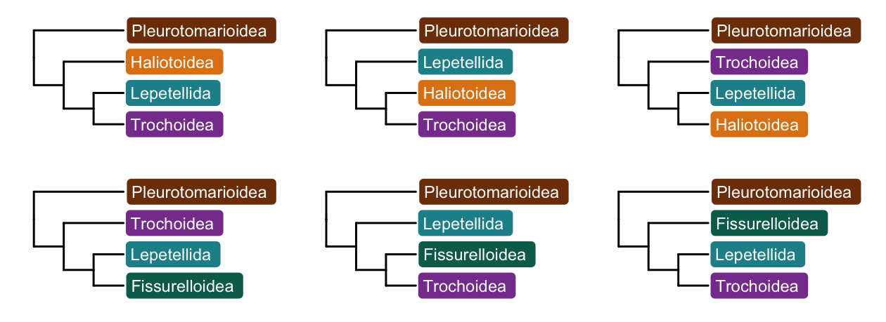
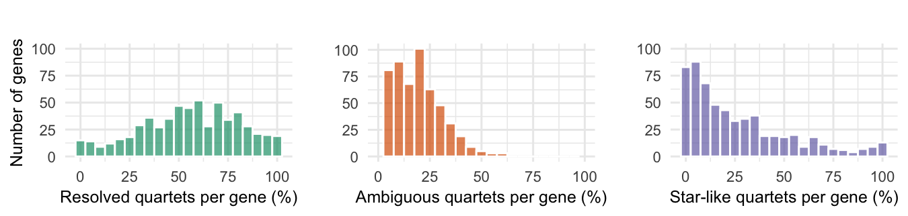
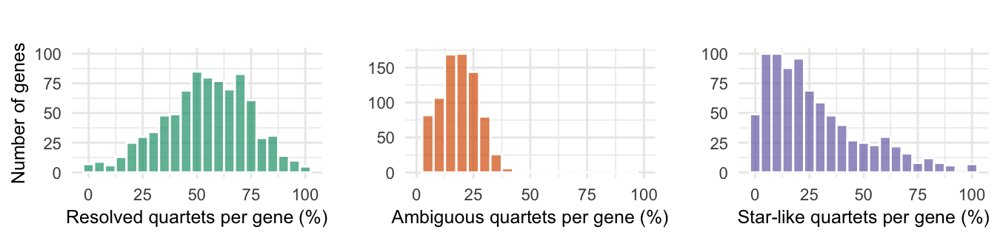
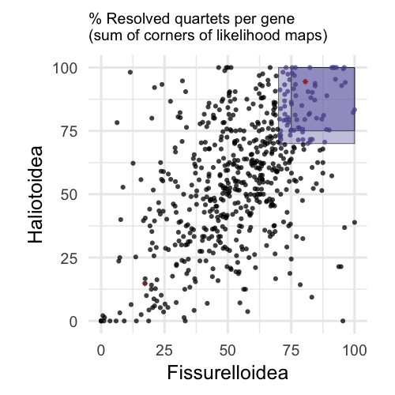
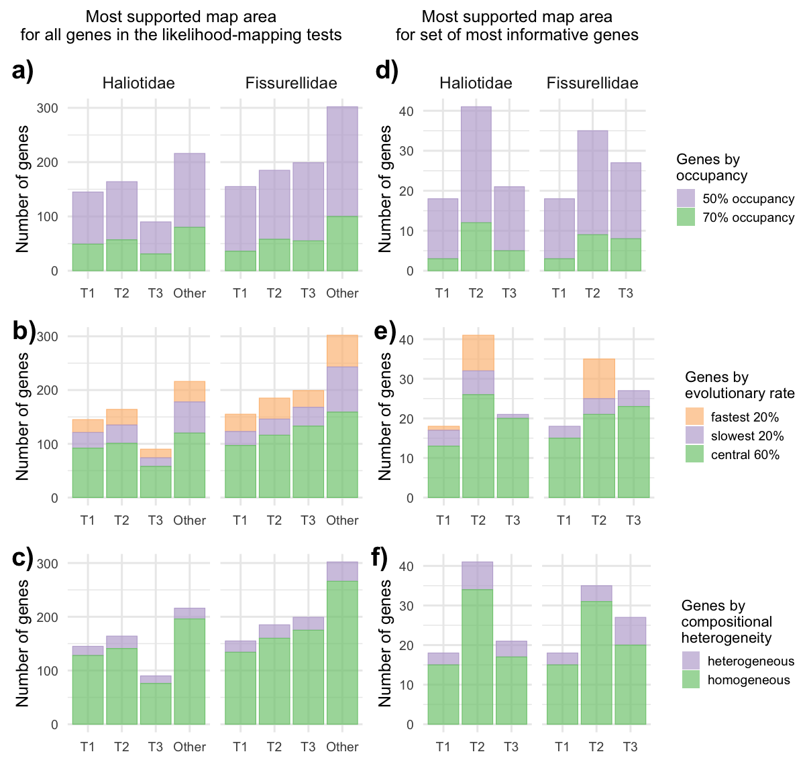
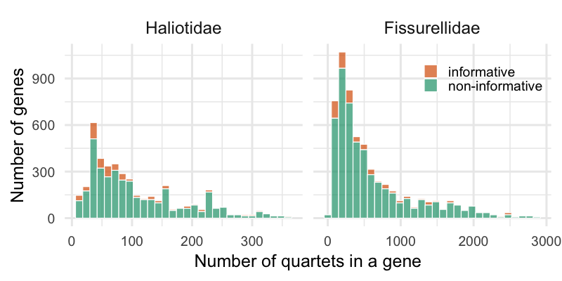

Supplementary Code S2: LMAP
================
Tauana Cunha \| <https://tauanacunha.com>
May 2021

<font size="4">Cunha et al. 2021. Investigating Sources of Conflict in
Deep Phylogenomics of Vetigastropod Snails. Systematic Biology.</font>

This html document contains the R code to produce the figures related to
the likelihood mapping tests. See the main article for more information.

------------------------------------------------------------------------

# Required libraries

``` r
.libPaths(new = "libR/")
library(tidyverse)
library(ggtree)
library(ggplot2)
library(cowplot)
```

# Alternative topologies: Figure 2a,b

Trees Haliotidae node:

``` r
n1H = "(((Trochoidea,Lepetellida),Haliotoidea),Pleurotomarioidea);"
n2H = "(((Trochoidea,Haliotoidea),Lepetellida),Pleurotomarioidea);"
n3H = "(((Haliotoidea,Lepetellida),Trochoidea),Pleurotomarioidea);"

t1H = phytools::read.newick(text = n1H)
t2H = phytools::read.newick(text = n2H)
t3H = phytools::read.newick(text = n3H)

treesH = list(t1H,t2H,t3H)
```

Trees Fissurellidae node:

``` r
n1F = "(((Fissurelloidea,Lepetellida),Trochoidea),Pleurotomarioidea);"
n2F = "(((Trochoidea,Fissurelloidea),Lepetellida),Pleurotomarioidea);"
n3F = "(((Trochoidea,Lepetellida),Fissurelloidea),Pleurotomarioidea);"

t1F = phytools::read.newick(text = n1F)
t2F = phytools::read.newick(text = n2F)
t3F = phytools::read.newick(text = n3F)

treesF = list(t1F,t2F,t3F)
```

Colors:

``` r
superfam_colors = list(
                  Pleurotomarioidea = "#7f3b08",
                  Haliotoidea = "#e08214",
                  Fissurelloidea = "#016c59",
                  Lepetellida = "#1c9099",
                  Trochoidea = "#88419d")
```

Plot trees Haliotidae node:

``` r
ggtrsH = purrr::map(.x = treesH, # size 0.4 equals 0.85pt in AI
                   .f = ~ggtree(tr = .x, right = TRUE, size=0.5)) # linetype=1

for(i in 1:length(ggtrsH)){
  ggtrsH[[i]] <- ggtrsH[[i]] +
    geom_tiplab(aes(fill = label), geom = "label",
              label.padding = unit(0.25, "lines"),
              label.size = 0,
              hjust = -.02,
              size = 3, # 2.5 = 7pt
              color = "white") + 
  scale_fill_manual(values = superfam_colors) +
  xlim(0, 8) +
  theme(legend.position = "none")}

grid_ggtrsH = plot_grid(plotlist = ggtrsH, ncol=3,
                       scale = 0.99)#, labels = c("a)", "", ""))
```

Plot trees Fissurellidae node:

``` r
ggtrsF = purrr::map(.x = treesF, # size 0.4 equals 0.85pt in AI
                   .f = ~ggtree(tr = .x, right = TRUE, size=0.5)) # linetype=1

for(i in 1:length(ggtrsF)){
  ggtrsF[[i]] <- ggtrsF[[i]] +
    geom_tiplab(aes(fill = label), geom = "label",
              label.padding = unit(0.25, "lines"),
              label.size = 0,
              hjust = -.02,
              size = 3, # 2.5 = 7pt
              color = "white") + 
  scale_fill_manual(values = superfam_colors) +
  xlim(0, 8) +
  theme(legend.position = "none")}

grid_ggtrsF = plot_grid(plotlist = ggtrsF, ncol=3,
                       scale = 0.99)#, labels = c("b)", "", ""))
```

Combine sets of trees:

``` r
grid_ggtrs_HF = plot_grid(grid_ggtrsH, grid_ggtrsF, ncol=1, byrow = T,
                          scale = 0.99)
grid_ggtrs_HF
```

<!-- -->

Save trees file:

``` r
ggsave(file = "../figures/lmap/topologiesHF.pdf", plot = grid_ggtrs_HF,
       width=6.3, height=2.3, units="in", useDingbats=F)
```

# Import data

Likelihood mapping of genes for Haliotidae node:

``` r
lmap_genes_H = read.csv("../data/lmap_summary_Haliotidae", sep = "") %>%
  mutate(OG = factor(paste0(OG, ".trimmed.fa"))) %>%
  rowwise() %>%
  mutate(Resolved = round(sum(a1,a2,a3)/X.quartets*100, digits=2),
         Edges = round(sum(a4,a5,a6)/X.quartets*100, digits=2),
         Unresolved = round(sum(a4,a5,a6,a7)/X.quartets*100, digits=2)) %>%
  select(OG, X.quartets, Resolved, Edges, Unresolved, a1:X.a7) %>%
  arrange(OG)
lmap_genes_H
```

    ## # A tibble: 596 x 19
    ## # Rowwise: 
    ##    OG    X.quartets Resolved Edges Unresolved    a1  X.a1    a2  X.a2    a3
    ##    <fct>      <int>    <dbl> <dbl>      <dbl> <int> <dbl> <int> <dbl> <int>
    ##  1 OG10…         38     36.8 42.1       63.2      0  0       14 36.8      0
    ##  2 OG10…         84     88.1 10.7       11.9     52 61.9     20 23.8      2
    ##  3 OG10…        276     70.3 22.8       29.7    175 63.4     13  4.71     6
    ##  4 OG10…         36     91.7  8.33       8.33     0  0       33 91.7      0
    ##  5 OG10…         54     48.2 31.5       51.8     19 35.2      5  9.26     2
    ##  6 OG10…         60     71.7 18.3       28.3     17 28.3     22 36.7      4
    ##  7 OG10…         36     83.3 11.1       16.7      1  2.78    26 72.2      3
    ##  8 OG10…         40     80    7.5       20        0  0        1  2.5     31
    ##  9 OG10…         32     75   12.5       25        0  0       20 62.5      4
    ## 10 OG10…        225     42.2 20         57.8     86 38.2      0  0        9
    ## # … with 586 more rows, and 9 more variables: X.a3 <dbl>, a4 <int>, X.a4 <dbl>,
    ## #   a5 <int>, X.a5 <dbl>, a6 <int>, X.a6 <dbl>, a7 <int>, X.a7 <dbl>

Likelihood mapping of genes for Fissurellidae node:

``` r
lmap_genes_F = read.csv("../data/lmap_summary_Fissurellidae", sep = "") %>%
  mutate(OG = factor(paste0(OG, ".trimmed.fa"))) %>%
  rowwise() %>%
  mutate(Resolved = round(sum(a1,a2,a3)/X.quartets*100, digits=2),
         Edges = round(sum(a4,a5,a6)/X.quartets*100, digits=2),
         Unresolved = round(sum(a4,a5,a6,a7)/X.quartets*100, digits=2)) %>%
  select(OG, X.quartets, Resolved, Edges, Unresolved, a1:X.a7) %>%
  arrange(OG)
lmap_genes_F
```

    ## # A tibble: 835 x 19
    ## # Rowwise: 
    ##    OG    X.quartets Resolved Edges Unresolved    a1  X.a1    a2  X.a2    a3
    ##    <fct>      <int>    <dbl> <dbl>      <dbl> <int> <dbl> <int> <dbl> <int>
    ##  1 OG10…        630     62.4 20.8       37.6    186 29.5      6  0.95   201
    ##  2 OG10…         90     41.1 23.3       58.9      0  0       18 20       19
    ##  3 OG10…        152     96.0  2.63       3.95     0  0      146 96.0      0
    ##  4 OG10…        288     54.5 27.4       45.5     41 14.2     28  9.72    88
    ##  5 OG10…        336     82.7 14.9       17.3    225 67.0     47 14.0      6
    ##  6 OG10…       1656     39.5 22.9       60.5     39  2.36   337 20.4    278
    ##  7 OG10…        108     75.9 18.5       24.1      7  6.48    72 66.7      3
    ##  8 OG10…        378     47.4 27.0       52.6     86 22.8     20  5.29    73
    ##  9 OG10…        360     82.5 15.6       17.5     21  5.83    19  5.28   257
    ## 10 OG10…        216     68.1 24.5       31.9     74 34.3     65 30.1      8
    ## # … with 825 more rows, and 9 more variables: X.a3 <dbl>, a4 <int>, X.a4 <dbl>,
    ## #   a5 <int>, X.a5 <dbl>, a6 <int>, X.a6 <dbl>, a7 <int>, X.a7 <dbl>

Alignment sizes:

``` r
sizes <- read.csv("../data/size_alignments.csv") %>%
  mutate(OG = factor(paste0(OG, ".trimmed.fa"))) %>% arrange(OG)
```

Evolutionary rates:

``` r
rates <- read.csv("../data/avg_trimal_scores", sep="") %>%
    mutate(rates_status = if_else(Conservation_Score < quantile(Conservation_Score,
                                                              probs=0.2),
         "fastest 20%",
         if_else(Conservation_Score > quantile(Conservation_Score, probs=0.8),
                 "slowest 20%","central 60%")),
         rates_status = fct_relevel(rates_status,
                                    "fastest 20%","slowest 20%","central 60%"))
```

p4 homogeneity test:

``` r
p4test <- read.csv("../data/p4_outcome_ordered.txt", sep="\t", header = F) %>%
  rename(OG = 'V1', p4_pval = 'V2') %>%
  mutate(p4_status = if_else(p4_pval<0.1, "heterogeneous", "homogeneous"))
```

Matrix occupancy:

``` r
occupancy <- read.csv("../data/occ.matrix.tsv", sep="\t") %>%
  column_to_rownames(var = "filename") %>%
  relocate(colSums(.) %>% sort %>% names) %>% # reorder species/columns by occupancy
  arrange(rowSums(.)) # reorder genes/lines by occupancy

occupancy = occupancy %>%
  rownames_to_column() %>%
  rowwise %>%
  mutate(ntaxa = sum(c_across(-1))) %>%
  rename(OG = rowname) %>%
  select(OG, ntaxa) %>%
  mutate(occupancy_status = if_else(ntaxa>=44, "70% occupancy", "50% occupancy"))
```

# Make main data frames by combining datasets

Merge datasets about gene properties (length to occupancy):

``` r
extra_data = inner_join(sizes, rates, by="OG") %>%
  inner_join(., p4test, by="OG") %>%
  inner_join(., occupancy, by="OG")
```

Merging LMAP for both nodes, and add criterion for considering gene
informative (minimum threshold of quartet support for corners of lmap):

``` r
resHF = full_join(lmap_genes_F %>% rename(Resolved_F = Resolved),
                  lmap_genes_H %>% rename(Resolved_H = Resolved), "OG") %>%
  select(OG, Resolved_H, Resolved_F) %>%
  mutate(determination = if_else(Resolved_F>=70 && Resolved_H>=70,
                                 "informative", "non-informative", missing="non-informative"))
```

Gather lmap triangle area for Haliotidae node:

``` r
gathered_H = lmap_genes_H %>%
  gather(key="lmap_area", value="percent",
         factor_key=T, starts_with("X.a")) %>%
  mutate(lmap_cat = if_else(grepl("1|2|3", lmap_area),
                            "Corner",
                            if_else(grepl("4|5|6", lmap_area), "Edge", "Star"))) %>%
  mutate(lmap_pos = if_else(grepl("1", lmap_area), "T1",
                            if_else(grepl("2", lmap_area), "T2",
                                    if_else(grepl("3", lmap_area), "T3", "Other")))) %>%
  mutate(lmap_pos = fct_relevel(lmap_pos, "T1", "T2", "T3", "Other")) %>%
  mutate(node = "Haliotidae")
```

Gather lmap triangle area for Fissurellidae node:

``` r
gathered_F = lmap_genes_F %>%
  gather(key="lmap_area", value="percent",
         factor_key=T, starts_with("X.a")) %>%
  mutate(lmap_cat = if_else(grepl("1|2|3", lmap_area),
                            "Corner",
                            if_else(grepl("4|5|6", lmap_area), "Edge", "Star"))) %>%
  mutate(lmap_pos = if_else(grepl("1", lmap_area), "T1",
                            if_else(grepl("2", lmap_area), "T2",
                                    if_else(grepl("3", lmap_area), "T3", "Other")))) %>%
  mutate(lmap_pos = fct_relevel(lmap_pos, "T1", "T2", "T3", "Other")) %>%
  mutate(node = "Fissurellidae")
```

Combine gathered df for both recalcitrant nodes, and add column on
informative x non-informative genes from resHF:

``` r
gathered = rbind(gathered_H, gathered_F) %>%
  mutate(node = fct_relevel(node, "Haliotidae", "Fissurellidae")) %>%
  left_join(., resHF %>% select(OG, determination),  by="OG") %>%
  left_join(., extra_data, by = "OG")
gathered
```

    ## # A tibble: 10,017 x 26
    ##    OG    X.quartets Resolved Edges Unresolved    a1    a2    a3    a4    a5
    ##    <chr>      <int>    <dbl> <dbl>      <dbl> <int> <int> <int> <int> <int>
    ##  1 OG10…         38     36.8 42.1       63.2      0    14     0    13     3
    ##  2 OG10…         84     88.1 10.7       11.9     52    20     2     7     0
    ##  3 OG10…        276     70.3 22.8       29.7    175    13     6    24    21
    ##  4 OG10…         36     91.7  8.33       8.33     0    33     0     1     2
    ##  5 OG10…         54     48.2 31.5       51.8     19     5     2     5     4
    ##  6 OG10…         60     71.7 18.3       28.3     17    22     4     6     1
    ##  7 OG10…         36     83.3 11.1       16.7      1    26     3     2     2
    ##  8 OG10…         40     80    7.5       20        0     1    31     0     0
    ##  9 OG10…         32     75   12.5       25        0    20     4     0     4
    ## 10 OG10…        225     42.2 20         57.8     86     0     9     0     0
    ## # … with 10,007 more rows, and 16 more variables: a6 <int>, a7 <int>,
    ## #   lmap_area <fct>, percent <dbl>, lmap_cat <chr>, lmap_pos <fct>, node <fct>,
    ## #   determination <chr>, Alignment_Length <int>, Conservation_Score <dbl>,
    ## #   Evolutionary_Rate <dbl>, rates_status <fct>, p4_pval <dbl>,
    ## #   p4_status <chr>, ntaxa <int>, occupancy_status <chr>

# LMAP Graphs

Area labels:

``` r
lmap_labs = c("Topology 1 (a1)", "Topology 2 (a2)", "Topology 3 (a3)",
              "Edge 1-2 (a4)", "Edge 2-3 (a5)", "Edge 1-3 (a6)", "Center (a7)")

names(lmap_labs) = gathered_H %>%
  select(lmap_area) %>% unique() %>% pull
```

## Summary by lmap categories

Plot summary of lmap areas for Haliotidae node:

``` r
p_resolved_H <- ggplot(lmap_genes_H, aes(x = Resolved)) +
  geom_histogram(binwidth = 5, alpha = .7, fill = "#1b9e77", color = "white") +
  ylim(0,100) +
  labs(title = "", x = "Resolved quartets per gene (%)", y = "Number of genes") +
  theme_minimal() +
  theme(axis.title = element_text(size = 9), axis.text = element_text(size = 8))
  
p_edges_H <- ggplot(lmap_genes_H, aes(x = Edges)) +
  geom_histogram(binwidth = 5, alpha = 0.7, fill = "#d95f02", color = "white") +
  xlim(0,100) +
  labs(title = "", x = "Ambiguous quartets per gene (%)", y = "") +
  theme_minimal() +
  theme(axis.title = element_text(size = 9), axis.text = element_text(size = 8))
  
p_star_H <- ggplot(lmap_genes_H, aes(x = X.a7)) +
  geom_histogram(binwidth = 5, alpha = 0.7, fill = "#7570b3", color = "white") +
  ylim(0,100) +
  theme_minimal() +
  labs(title="",x="Star-like quartets per gene (%)", y="") +
  theme(axis.title = element_text(size = 9), axis.text = element_text(size = 8))

sumplot_H = plot_grid(p_resolved_H, p_edges_H, p_star_H, ncol = 3)
sumplot_H
```

<!-- -->

Plot summary of areas (Fissurellidae node):

``` r
p_resolved_F <- ggplot(lmap_genes_F, aes(x = Resolved)) +
  geom_histogram(binwidth = 5, alpha = .7, fill = "#1b9e77", color = "white") +
  ylim(0,100) +
  labs(title = "", x = "Resolved quartets per gene (%)", y = "Number of genes") +
  theme_minimal() +
  theme(axis.title = element_text(size = 9), axis.text = element_text(size = 8))
  
p_edges_F <- ggplot(lmap_genes_F, aes(x = Edges)) +
  geom_histogram(binwidth = 5, alpha = 0.7, fill = "#d95f02", color = "white") +
  xlim(0,100) +
  labs(title = "", x = "Ambiguous quartets per gene (%)", y = "") +
  theme_minimal() +
  theme(axis.title = element_text(size = 9), axis.text = element_text(size = 8))
  
p_star_F <- ggplot(lmap_genes_F, aes(x = X.a7)) +
  geom_histogram(binwidth = 5, alpha = 0.7, fill = "#7570b3", color = "white") +
  ylim(0,100) +
  theme_minimal() +
  labs(title="",x="Star-like quartets per gene (%)", y="") +
  theme(axis.title = element_text(size = 9), axis.text = element_text(size = 8))

sumplot_F = plot_grid(p_resolved_F, p_edges_F, p_star_F, ncol = 3)
sumplot_F
```

<!-- -->

Save summary lmap plot:

``` r
ggsave(file = "../figures/lmap/lmap_summary_Haliotidae.pdf", plot = sumplot_H,
       width=6.75, height=1.61, units="in", useDingbats=F)
ggsave(file = "../figures/lmap/lmap_summary_Fissurellidae.pdf", plot = sumplot_F,
       width=6.75, height=1.61, units="in", useDingbats=F)
```

## Resolved quartets: Figure 2c

Selecting example genes to highlight as the triangle maps in Figure 2 of
paper:

``` r
#resHF %>% filter(determination == "informative") # OG1160
#resHF %>% filter(Resolved_F<25 & Resolved_H<25) # OG38622
resHF %>% filter(OG == "OG1160.trimmed.fa" | OG == "OG38622.trimmed.fa")
```

    ## # A tibble: 2 x 4
    ## # Rowwise: 
    ##   OG                 Resolved_H Resolved_F determination  
    ##   <fct>                   <dbl>      <dbl> <chr>          
    ## 1 OG1160.trimmed.fa        94.4       80.6 informative    
    ## 2 OG38622.trimmed.fa       14.8       17.3 non-informative

Plot resolved quartets for both recalcitrant nodes, Figure 2 of
manuscript:

``` r
p_resolved_both_nodes = ggplot() +
  geom_rect(aes(xmin = 70, xmax = 100, ymin = 70, ymax = 100),
            fill = "#7570B3", alpha = 0.4, color = "black", size = 0.1) +
  geom_rect(aes(xmin = 75, xmax = 100, ymin = 75, ymax = 100),
            fill = "#7570B3", alpha = 0.5, color = "black", size = 0.1) +
  geom_point(data = resHF,
             mapping = aes(x=Resolved_F, y=Resolved_H, color = determination),
             show.legend = F, shape = 16, alpha = 0.75, size = .7) +
  scale_color_manual(values = c("#565196", "black")) +
  geom_point(data = subset(resHF, OG == "OG1160.trimmed.fa" | OG == "OG38622.trimmed.fa"),
             mapping = aes(x=Resolved_F, y=Resolved_H),
             shape = 8, color = "firebrick", size = .7, stroke =0.2) +
  labs(title = "% Resolved quartets per gene\n(sum of corners of likelihood maps)",
       y = "Haliotoidea",
       x = "Fissurelloidea") +
  coord_equal() +
  theme_minimal() +
  theme(plot.title = element_text(size = 7),
        axis.title = element_text(size = 9),
        axis.text = element_text(size = 7))
p_resolved_both_nodes
```

<!-- -->

Save plot:

``` r
ggsave(file = "../figures/lmap/resolved_both_nodes.pdf", plot = p_resolved_both_nodes,
       width=2.5, height=2.5, units="in", useDingbats=F)
```

    ## Warning: Removed 239 rows containing missing values (geom_point).

# Subset of genes for StarBeast2

Pick subset of most informative genes, the ones with highest percentage
of resolved / lowest percentage of unresolved quartets:

Set of genes that are well resolved for both Haliotoidea and
Fissurelloidea:

``` r
resolved70_HF = resHF %>% filter(Resolved_F>=70 & Resolved_H>=70)
resolved75_HF = resHF %>% filter(Resolved_F>=75 & Resolved_H>=75)
resolved70_HF # 80 genes
```

    ## # A tibble: 80 x 4
    ## # Rowwise: 
    ##    OG                 Resolved_H Resolved_F determination
    ##    <fct>                   <dbl>      <dbl> <chr>        
    ##  1 OG10296.trimmed.fa       88.1       82.7 informative  
    ##  2 OG10468.trimmed.fa       91.7       75.9 informative  
    ##  3 OG10540.trimmed.fa       71.7       82.5 informative  
    ##  4 OG10634.trimmed.fa       75         70.8 informative  
    ##  5 OG11529.trimmed.fa       85         79.2 informative  
    ##  6 OG1160.trimmed.fa        94.4       80.6 informative  
    ##  7 OG13224.trimmed.fa       70         70.7 informative  
    ##  8 OG13424.trimmed.fa       79.6       87.0 informative  
    ##  9 OG14476.trimmed.fa      100         76.7 informative  
    ## 10 OG15011.trimmed.fa       70         81.6 informative  
    ## # … with 70 more rows

``` r
resolved75_HF # 44 genes
```

    ## # A tibble: 44 x 4
    ## # Rowwise: 
    ##    OG                 Resolved_H Resolved_F determination
    ##    <fct>                   <dbl>      <dbl> <chr>        
    ##  1 OG10296.trimmed.fa       88.1       82.7 informative  
    ##  2 OG10468.trimmed.fa       91.7       75.9 informative  
    ##  3 OG11529.trimmed.fa       85         79.2 informative  
    ##  4 OG1160.trimmed.fa        94.4       80.6 informative  
    ##  5 OG13424.trimmed.fa       79.6       87.0 informative  
    ##  6 OG14476.trimmed.fa      100         76.7 informative  
    ##  7 OG15053.trimmed.fa       88.9       76.8 informative  
    ##  8 OG15745.trimmed.fa       92.9       94.9 informative  
    ##  9 OG1612.trimmed.fa        79.5       80.3 informative  
    ## 10 OG17546.trimmed.fa       87.2       84.2 informative  
    ## # … with 34 more rows

Save selection of more resolved genes:

``` r
#write.table(resolved70_HF$OG, file="../data/Content_OGslice_Resolved70",
#            quote=F, row.names=F, col.names=F)
#write.table(resolved75_HF$OG, file="../data/Content_OGslice_Resolved75",
#            quote=F, row.names=F, col.names=F)
```

# Supplementary Figure: phylogenetic signal by gene properties

Determine which area of the LMAP plot has the highest quartet support
per gene:

``` r
top_area = gathered %>%
  group_by(node, OG) %>% # For each gene
  #slice(which.max(percent)) # slice only one line with the highest % quartet
  filter(percent == max(percent)) %>% # allows multiple max matches
  arrange(OG) #%>%
  #ungroup() %>% group_by(node) %>% group_split(node)
top_area
```

    ## # A tibble: 1,456 x 26
    ## # Groups:   node, OG [1,431]
    ##    OG    X.quartets Resolved Edges Unresolved    a1    a2    a3    a4    a5
    ##    <chr>      <int>    <dbl> <dbl>      <dbl> <int> <int> <int> <int> <int>
    ##  1 OG10…        630     62.4 20.8       37.6    186     6   201    16     5
    ##  2 OG10…         90     41.1 23.3       58.9      0    18    19     0    18
    ##  3 OG10…         38     36.8 42.1       63.2      0    14     0    13     3
    ##  4 OG10…        152     96.0  2.63       3.95     0   146     0     2     2
    ##  5 OG10…        288     54.5 27.4       45.5     41    28    88    19    27
    ##  6 OG10…         84     88.1 10.7       11.9     52    20     2     7     0
    ##  7 OG10…        336     82.7 14.9       17.3    225    47     6    27     0
    ##  8 OG10…        276     70.3 22.8       29.7    175    13     6    24    21
    ##  9 OG10…       1656     39.5 22.9       60.5     39   337   278   191   147
    ## 10 OG10…         36     91.7  8.33       8.33     0    33     0     1     2
    ## # … with 1,446 more rows, and 16 more variables: a6 <int>, a7 <int>,
    ## #   lmap_area <fct>, percent <dbl>, lmap_cat <chr>, lmap_pos <fct>, node <fct>,
    ## #   determination <chr>, Alignment_Length <int>, Conservation_Score <dbl>,
    ## #   Evolutionary_Rate <dbl>, rates_status <fct>, p4_pval <dbl>,
    ## #   p4_status <chr>, ntaxa <int>, occupancy_status <chr>

Plot genes supporting each topology, according to category of potential
bias:

``` r
p_lmap_rates = top_area %>%
  group_by(node, lmap_pos, rates_status) %>%
  summarise("Ngenes"=n()) %>%
  ggplot() +
  geom_col(aes(x = lmap_pos, y = Ngenes,
               fill = rates_status, color = rates_status),
           alpha = 0.7, size = .2) +
  theme_minimal() +
  facet_wrap(~node) +
  labs(title = "", x = "", y = "Number of genes") +
  scale_fill_brewer(type = "qual", palette = 1, direction = -1,
                    name = "Genes by\nevolutionary rate") +
  guides(color = FALSE) +
  scale_color_brewer(type = "qual", palette = 1, direction = -1) +
  theme(strip.text = element_blank(),
        axis.title = element_text(size = 9),
        axis.text = element_text(size = 7),
        title = element_text(size = 8),
        legend.position = "none",
        plot.margin = unit(c(-0.2, 0, -0.2, 0.3), "cm"))

p_lmap_p4 = top_area %>%
  group_by(node, lmap_pos, p4_status) %>%
  summarise("Ngenes"=n()) %>%
  ggplot() +
  geom_col(aes(x = lmap_pos, y = Ngenes,
               fill = p4_status, color = p4_status),
           alpha = 0.7, size = .2) +
  theme_minimal() +
  facet_wrap(~node) +
  labs(title = "", x = "", y = "Number of genes") +
  scale_fill_brewer(type = "qual", palette = 1, direction = -1,
                    name = "Genes by\ncompositional\nheterogeneity") +
  guides(color = FALSE) +
  scale_color_brewer(type = "qual", palette = 1, direction = -1) +
  theme(strip.text = element_blank(),
        axis.title = element_text(size = 9),
        axis.text = element_text(size = 7),
        title = element_text(size = 8),
        legend.position = "none",
        plot.margin = unit(c(-0.2, 0, -0.2, 0.3), "cm"))

p_lmap_occup = top_area %>%
  group_by(node, lmap_pos, occupancy_status) %>%
  summarise("Ngenes"=n()) %>%
  ggplot() +
  geom_col(aes(x = lmap_pos, y = Ngenes,
               fill = occupancy_status, color = occupancy_status),
           alpha = 0.7, size = .2) +
  theme_minimal() +
  facet_wrap(~node) +
  labs(title = "", x = "", y = "Number of genes") +
  scale_fill_brewer(type = "qual", palette = 1, direction = -1,
                    name = "Genes by\noccupancy") +
  guides(color = FALSE) +
  scale_color_brewer(type = "qual", palette = 1, direction = -1) +
  theme(axis.title = element_text(size = 9),
        axis.text = element_text(size = 7),
        title = element_text(size = 8),
        legend.position = "none",
        plot.margin = unit(c(-0.2, 0, -0.2, 0.3), "cm"))

grid_title_lmap = ggdraw() +
  draw_label("Most supported map area\nfor all genes in the likelihood-mapping tests",
             size = 9)

p_top_areas_lmap = plot_grid(p_lmap_occup, p_lmap_rates, p_lmap_p4, align = "v",
                             ncol = 1, labels = c("a)","b)","c)"),
                             rel_heights=c(1, 0.87, 0.87))

p_top_areas_lmap = plot_grid(grid_title_lmap, p_top_areas_lmap, 
                             ncol = 1, rel_heights=c(0.07, 1))
#p_top_areas_lmap
```

Same graphs, but restricted to most informative genes:

``` r
p_res70_rates = top_area %>%
  filter(determination == "informative") %>%
  group_by(node, lmap_pos, rates_status) %>%
  summarise("Ngenes"=n()) %>%
  ggplot() +
  geom_col(aes(x = lmap_pos, y = Ngenes,
               fill = rates_status, color = rates_status),
           alpha = 0.7, size = .2) +
  theme_minimal() +
  facet_wrap(~node) +
  labs(title = "", x = "", y = "Number of genes") +
  scale_fill_brewer(type = "qual", palette = 1, direction = -1,
                    name = "Genes by\nevolutionary rate") +
  guides(color = FALSE) +
  scale_color_brewer(type = "qual", palette = 1, direction = -1) +
  theme(strip.text = element_blank(),
        axis.title = element_text(size = 9),
        axis.text = element_text(size = 7),
        title = element_text(size = 8),
        legend.key.size = unit(.7,"line"),
        legend.title = element_text(size = 8),
        legend.text = element_text(size = 7),
        plot.margin = unit(c(-0.2, 0, -0.2, 0.3), "cm"))

p_res70_p4 = top_area %>%
  filter(determination == "informative") %>%
  group_by(node, lmap_pos, p4_status) %>%
  summarise("Ngenes"=n()) %>%
  ggplot() +
  geom_col(aes(x = lmap_pos, y = Ngenes,
               fill = p4_status, color = p4_status),
           alpha = 0.7, size = .2) +
  theme_minimal() +
  facet_wrap(~node) +
  labs(title = "", x = "", y = "Number of genes") +
  scale_fill_brewer(type = "qual", palette = 1, direction = -1,
                    name = "Genes by\ncompositional\nheterogeneity") +
  guides(color = FALSE) +
  scale_color_brewer(type = "qual", palette = 1, direction = -1) +
  theme(strip.text = element_blank(),
        axis.title = element_text(size = 9),
        axis.text = element_text(size = 7),
        title = element_text(size = 8),
        legend.key.size = unit(.7,"line"),
        legend.title = element_text(size = 8),
        legend.text = element_text(size = 7),
        plot.margin = unit(c(-0.2, 0, -0.2, 0.3), "cm"))

p_res70_occup = top_area %>%
  filter(determination == "informative") %>%
  group_by(node, lmap_pos, occupancy_status) %>%
  summarise("Ngenes"=n()) %>%
  ggplot() +
  geom_col(aes(x = lmap_pos, y = Ngenes,
               fill = occupancy_status, color = occupancy_status),
           alpha = 0.7, size = .2) +
  theme_minimal() +
  facet_wrap(~node) +
  labs(title = "", x = "", y = "Number of genes") +
  scale_fill_brewer(type = "qual", palette = 1, direction = -1,
                    name = "Genes by\noccupancy") +
  guides(color = FALSE) +
  scale_color_brewer(type = "qual", palette = 1, direction = -1) +
  theme(axis.title = element_text(size = 9),
        axis.text = element_text(size = 7),
        title = element_text(size = 8),
        legend.key.size = unit(.7,"line"),
        legend.title = element_text(size = 8),
        legend.text = element_text(size = 7),
        plot.margin = unit(c(-0.2, 0, -0.2, 0.3), "cm"))

grid_title_res70 = ggdraw() +
  draw_label("Most supported map area\nfor set of most informative genes",
             size = 9, x = .35)

p_top_areas_res70 = plot_grid(p_res70_occup, p_res70_rates, p_res70_p4,
                              ncol = 1, labels = c("d)","e)","f)"),
                              rel_heights=c(1, 0.87, 0.87))

p_top_areas_res70 = plot_grid(grid_title_res70, p_top_areas_res70, 
                              ncol = 1, rel_heights=c(0.07, 1))
#p_top_areas_res70
```

All together:

``` r
top_supported_areas = plot_grid(p_top_areas_lmap, p_top_areas_res70, 
                              ncol = 2, rel_widths=c(0.82, 1))
top_supported_areas
```

<!-- -->

Save plot:

``` r
ggsave(file = "../figures/lmap/top_supported_areas.pdf", plot = top_supported_areas,
       width=6, height=5.7, units="in", useDingbats=F)
```

## Supplementary Figure: total number of quartets

Range of the number of total possible quartets per gene for each node:

``` r
gathered %>%
  group_by(node) %>%
  summarise(range(X.quartets))
```

    ## `summarise()` regrouping output by 'node' (override with `.groups` argument)

    ## # A tibble: 4 x 2
    ## # Groups:   node [2]
    ##   node          `range(X.quartets)`
    ##   <fct>                       <int>
    ## 1 Haliotidae                     12
    ## 2 Haliotidae                    360
    ## 3 Fissurellidae                  48
    ## 4 Fissurellidae                2916

Plot total number of quartets:

``` r
Nquartets = ggplot(gathered) +
  geom_histogram(aes(x = X.quartets, fill = determination),
                 bins = 30, size = .2,
                 color = "white", alpha = 0.7) +
  scale_fill_brewer(type = "qual", palette = 2, direction = -1) +
  labs(x = "Number of quartets in a gene", y = "Number of genes") +
  theme_minimal() +
  facet_wrap(~node, scales = "free_x") +
  theme(legend.title = element_blank(),
        legend.position = c(.86,.84),
        axis.title = element_text(size = 9),
        axis.text = element_text(size = 7),
        legend.key.size = unit(.5,"line"),
        legend.text = element_text(size = 7))
Nquartets
```

<!-- -->

Save plot:

``` r
ggsave(file = "../figures/lmap/Nquartets.pdf", plot = Nquartets,
       width=4, height=2, units="in", useDingbats=F)
```
