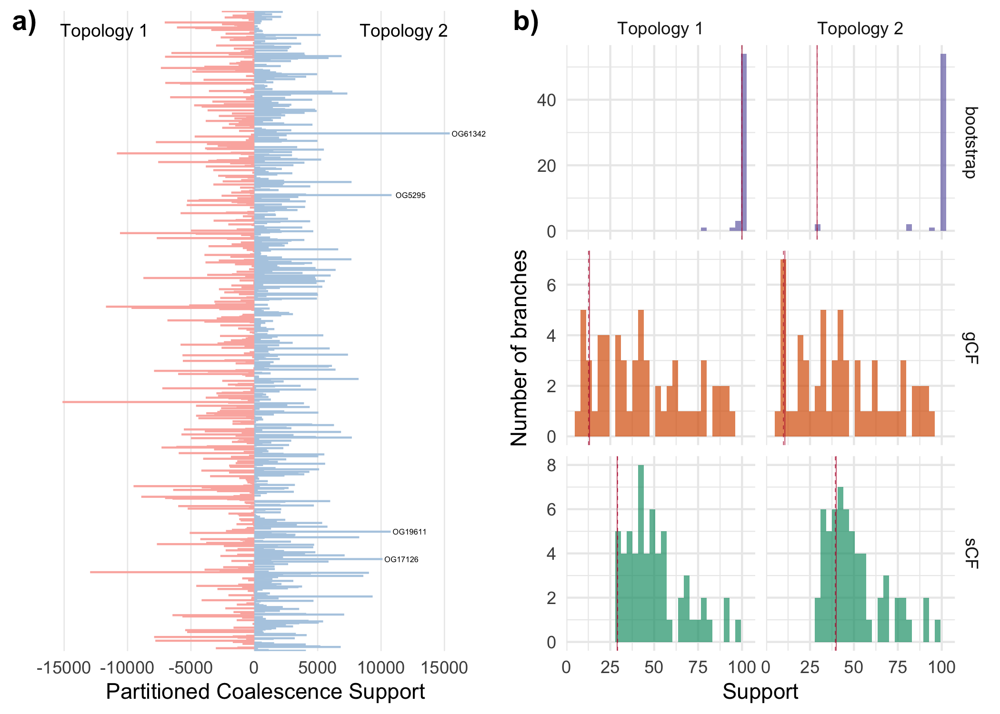

Supplementary Code S3: CF and PCS
================
Tauana Cunha \| <https://tauanacunha.com>
May 2021

<font size="4">Cunha et al. 2021. Investigating Sources of Conflict in
Deep Phylogenomics of Vetigastropod Snails. Systematic Biology.</font>

This document contains the R code to produce the figures related to
concordance factors and partitioned coalescent support. See the main
article for more information.

------------------------------------------------------------------------

# Required libraries

``` r
.libPaths(new = "libR/")
library(viridis)
library(ggplot2)
library(tidyverse)
library(ggrepel)
library(cowplot)
```

# Concordance Factors

## Read the data

``` r
d_cat = read.delim("../results/*concordance_factors/iqtree-cat_31taxa/ConcFact.cf.stat",
               header = T, comment.char = '#')
d_part = read.delim("../results/*concordance_factors/iqtree-part_31taxa/ConcFact.cf.stat",
               header = T, comment.char = '#')
names(d_cat)[18] = names(d_part)[18] = "bootstrap"
names(d_cat)[19] = names(d_part)[19] = "branchlength"

d_cat$tree = "Topology 1" # M1-IQTREEcat
d_part$tree = "Topology 2" # M1-IQTREEpart

d = rbind(d_cat, d_part)
```

## Nodes of interest

Select key nodes (conflicting ones):

``` r
key_nodes = d %>%
  filter(ID %in% c(69,87) & tree %in% "Topology 1" |
           ID %in% c(69,70) & tree %in% "Topology 2") %>%
  mutate(nodeID = c(2,1,4,3),# From Fig 3 (phylogeny)
         node_res = c("Node 2 or 4","Node 1 or 3","Node 2 or 4","Node 1 or 3")) 
key_nodes
```

    ##   ID   gCF gCF_N  gDF1 gDF1_N  gDF2 gDF2_N  gDFP gDFP_N   gN   sCF  sCF_N  sDF1
    ## 1 69 12.62    91  9.85     71  4.85     35 72.68    524  721 29.18 357.50 42.12
    ## 2 87 13.20   132 10.80    108  9.00     90 67.00    670 1000 28.90 421.90 39.74
    ## 3 69  9.85    71  7.91     57  7.91     57 74.34    536  721 39.40 615.25 30.54
    ## 4 70 10.70   107  8.80     88 13.20    132 67.30    673 1000 39.92 515.73 31.43
    ##   sDF1_N  sDF2 sDF2_N      sN bootstrap branchlength       tree nodeID
    ## 1 501.93 28.70 346.24 1205.67       100    0.0130819 Topology 1      2
    ## 2 533.39 31.36 466.08 1421.37       100    0.0158635 Topology 1      1
    ## 3 470.37 30.06 460.95 1546.57        29    0.0155310 Topology 2      4
    ## 4 441.05 28.64 393.94 1350.72        29    0.0155340 Topology 2      3
    ##      node_res
    ## 1 Node 2 or 4
    ## 2 Node 1 or 3
    ## 3 Node 2 or 4
    ## 4 Node 1 or 3

Calculate quantile of such nodes:

``` r
for(i in 1:4){
  key_nodes$percentile_gCF[i] = d %>%
    filter(tree == key_nodes$tree[i]) %>%
    mutate(percentile = gCF < key_nodes$gCF[i]) %>% # % of branches < key node
    summarise(percentile = mean(percentile)) %>% pull}

for(i in 1:4){
  key_nodes$percentile_sCF[i] = d %>%
    filter(tree == key_nodes$tree[i]) %>%
    mutate(percentile = sCF < key_nodes$sCF[i]) %>% # % of branches < key node
    summarise(percentile = mean(percentile)) %>% pull}

key_nodes %>%
  select(ID, nodeID, tree, gCF, sCF, percentile_gCF, percentile_sCF)
```

    ##   ID nodeID       tree   gCF   sCF percentile_gCF percentile_sCF
    ## 1 69      2 Topology 1 12.62 29.18     0.10169492     0.01694915
    ## 2 87      1 Topology 1 13.20 28.90     0.11864407     0.00000000
    ## 3 69      4 Topology 2  9.85 39.40     0.05084746     0.28813559
    ## 4 70      3 Topology 2 10.70 39.92     0.11864407     0.30508475


## Plot CFs of all branches

``` r
p_CF = d %>% gather("support_type", "support_value", bootstrap, gCF, sCF) %>%
  ggplot(aes(x = support_value)) + 
  geom_histogram(aes(fill = support_type), bins = 30, alpha = 0.7, show.legend = F) +
  scale_fill_brewer(type = "qual", palette = 2, direction = -1) +
  labs(x = "Support", y = "Number of branches") +
  theme_minimal() +
  facet_grid(support_type~tree, scales = "free_y") +
  geom_vline(data = key_nodes %>%
               gather("support_type", "support_value", bootstrap, gCF, sCF),
             aes(xintercept = support_value, linetype = node_res),
             col = "#B50033", size = 0.15, show.legend = F)
p_CF
```

<!-- -->

Save:

``` r
ggsave(file = "../figures/pcs_cf/concordance_factors.pdf", plot = p_CF,
       width=3, height=4, units="in", useDingbats=F)
```

Plot brench lenghts:

``` r
d %>%
  ggplot(aes(x = branchlength)) + 
  geom_histogram(bins = 30, alpha = 0.7) +
  labs(x = "Branchlength", y = "Number of branches") +
  theme_minimal() +
  facet_wrap(~tree) +
  geom_vline(data = key_nodes %>%
                    gather("support_type", "support_value", bootstrap, gCF, sCF),
             aes(xintercept = branchlength, linetype = node_res),
             col = "#B50033", size = 0.15, show.legend = F)
```

<!-- -->


# Partitioned Coalescent Support

## Read the data

List of genes/orthogroup names:

``` r
content31 = read.csv("../data/Content_OGslice_31taxa", header = F, col.names = "OG") %>%
  mutate(across(where(is.character), str_remove_all, pattern = fixed(".trimmed.fa")))
```

Partitioned coalescent support:

``` r
pcs = read.csv("../data/PCS_astral_31taxa.txt", sep = "\t") %>%
  mutate(color = ifelse(PCS > 0, "positive", "negative")) %>%
  filter(Gene != "SUM") %>%
  cbind(content31)
pcs
```

Take a look at genes with the highest positive PCS scores:

``` r
pcs %>% filter(PCS > 10000)
```

    ##       Gene OptimalTree_Raw..Astral_31taxa.backup.tree AltTree1_Raw
    ## 1 Gene 148                                     739375       696307
    ## 2 Gene 192                                     822247       778529
    ## 3 Gene 732                                     746991       703209
    ## 4 Gene 831                                     821548       773173
    ##   OptimalTree_Corrected..Astral_31taxa.backup.tree AltTree1_Corrected
    ## 1                                           181530             171414
    ## 2                                           264402             253636
    ## 3                                           189146             178316
    ## 4                                           263703             248280
    ##   AltTree1_Difference   PCS Supported.Tree    color      OG
    ## 1               10116 10116              0 positive OG17126
    ## 2               10766 10766              0 positive OG19611
    ## 3               10830 10830              0 positive  OG5295
    ## 4               15423 15423              0 positive OG61342


## Plot PCS

``` r
pcs_p = ggplot(pcs) +
  geom_segment(aes(x = 0, xend = PCS, y = OG, yend = OG,
                   col = color), #, label = OG
               size=.5, show.legend = F) +
  geom_text(data = pcs %>% filter(PCS > 10000),
            aes(x = PCS+1500, y = OG, label = OG),
            color = "black", size = 1.4) +
  annotate(geom = "text", x = 11810, y = 997, label = "Topology 2", size = 9/.pt) +
  annotate(geom = "text", x = -11810, y = 997, label = "Topology 1", size = 9/.pt) +
  labs(x = "Partitioned Coalescence Support", y = "") +
  scale_color_brewer(type = "qual", palette = 4, direction = 1) +
  scale_x_continuous(breaks = seq(-15000,15000, 5000)) +
  theme_minimal() +
  theme(axis.text.y = element_blank(),
        panel.grid  = element_blank(),
        panel.grid.major.x = element_line(size=.3, color="#EBEBEB"))
pcs_p
```

<!-- -->

Save:

``` r
ggsave(file = "../figures/pcs_cf/pcs.pdf", plot = pcs_p,
       width=3, height=4, units="in", useDingbats=F)
```


# Joint plot CF/PCS support

Join plots CF and PCS:

``` r
CF_PCS_p = plot_grid(pcs_p, p_CF, labels = c("a)", "b)"))
CF_PCS_p
```

<!-- -->

Save image:

``` r
ggsave(file = "../figures/pcs_cf/CF_PCS.pdf", plot = CF_PCS_p,
       width=6.75, height=4.5, units="in", useDingbats=F)
```
